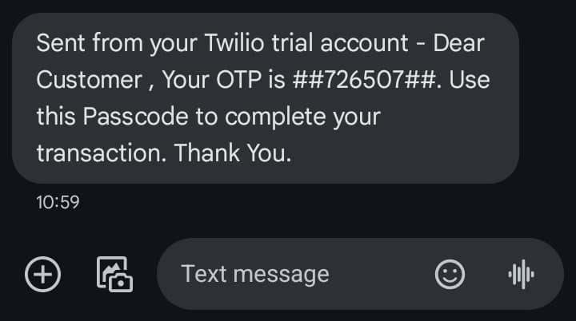

# twilio-sms-otp

This application demonstrates sending and validating of OTP codes using Twilio and Redis.

---

### How to run application

1. Clone this repository using the command:

```bash
git clone https://github.com/bruce-mig/twilio-sms-otp.git
```

2. Navigate to application directory `cd twilio-sms-otp`.

3. Create a `set-env.sh` file fill in the appropriate values.

```bash
#!/bin/bash
set -e

export ACCOUNT_SID=**********************
export AUTH_TOKEN=**********************
export TRIAL_NUMBER=<twilio-trial-number>
```

   The `TRIAL_NUMBER` is provided when one creates a twilio account at [twilio](https://www.twilio.com/en-us)

4. Start Redis server using command `docker compose up`

5. Run the following commands:

```bash
cd twilio-sms-otp \
sudo chmod +x set-env.sh \
source ./set-env.sh \
mvn spring-boot:run
```
The application will start at port `:8080`

---

### Get OTP

Using HTTPie CLI commands. You can download HTTPie CLI [here](https://httpie.io/cli)

```bash
http POST :8080/route/sendOTP \
> phone_number=<phone-number-registered-with-twilio> \
> user_name=test-user
```

The Response will be:

```bash
HTTP/1.1 200 OK
Content-Length: 133
Content-Type: application/json

{
"message": "Dear Customer , Your OTP is ##726507##. Use this Passcode to complete your transaction. Thank You. Your OTP Expires in 5 minutes",
"status": "DELIVERED"
}
```

And SMS message is sent to phone:



### Validate OTP

Send POST request via cli:

```bash
http POST :8080/route/validateOTP \
> user_name=test-user \
> otp=726507
```

Response:

```bash
HTTP/1.1 200 OK
Content-Length: 4
Content-Type: application/json

true

```

Sending response after validate or after expiration time of 5 min: 

```bash
http POST :8080/route/validateOTP user_name=test-user otp=726507
```

Will have an invalid response

```bash
HTTP/1.1 200 OK
Content-Length: 5
Content-Type: application/json

false
```

---

#### Technologies used:

- Spring Webflux
- Twilio
- Functional Endpoints
- Reactive Programming
- Redis